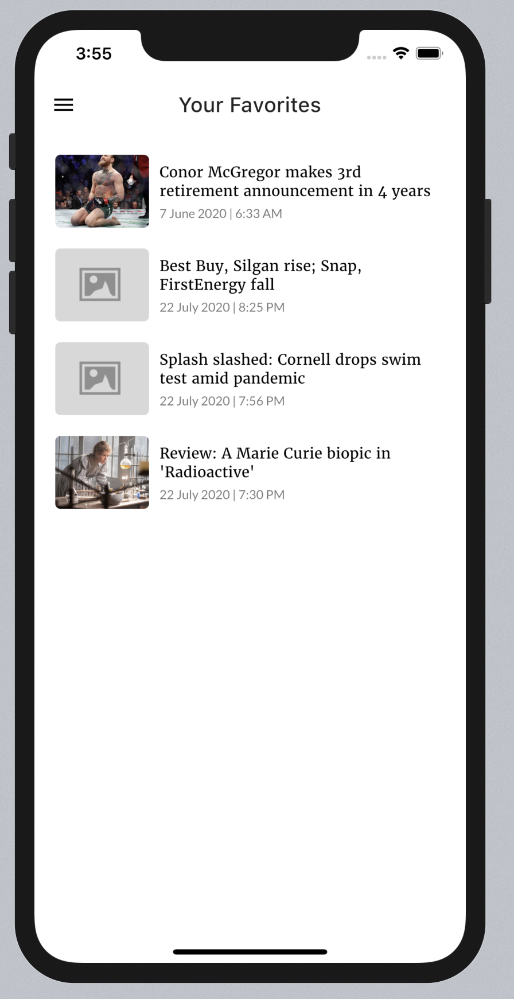

# Mercury

A Flutter news reader app which fetches news from , which was developed for Flutter Jakarta App Challenge #1.

The name *Mercury* comes from Roman God *Mercury*, a god of communications and messages also known as *Hermes* in Greek mythology. 

### Design

The app features a black and white theme inspired from [Newspaper by Andrew Drozd -- Dribbble](https://dribbble.com/shots/7229348-Newspaper), and uses the font [Merriweather](https://fonts.google.com/specimen/Merriweather).

### Screenshots

<pre>
     
</pre>

# Features

- Select curated list of news sources which are divided into three categories: English, Mandarin and Others.
- Tap on a source to see articles from that source. 
- Filter articles based on title.
- Favorite an article that you like by tapping on 'Heart' button. Favorited articles can be accessed through the page 'Favorited Articles'

# Running the app

To run the app, you'll need to get an API Key from [newsapi.org](https://newsapi.org). Then, create a JSON file in `/assets/api_key.json` and create a field called `key` to inject your API key. An example:

```
{
    "key": "YOUR_API_KEY_HERE"
}
```

See `/lib/secret/secret_loader.dart` for details on the API key injection mechanism.
